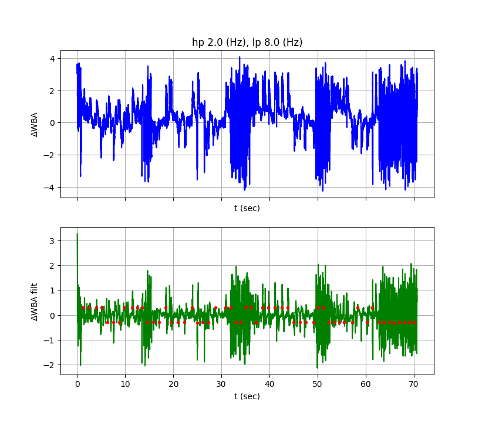

# simple-saccade-finder: a simple library for detecting saccades from delta wingbeat data 

This library implements the same method used by the flybraton system for
detecting saccades from delta wingbeat data.  



## Installing 

Install using pip 

```bash
$ pip install servodoor 

Install using uv

```bash
$uv sync


